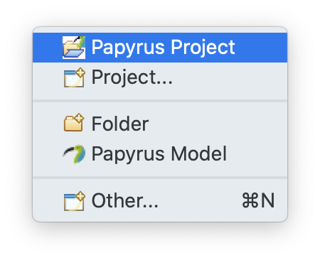
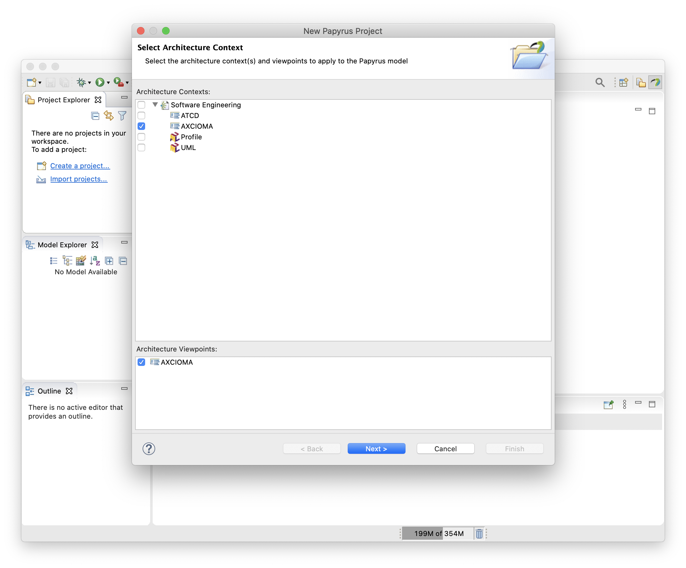
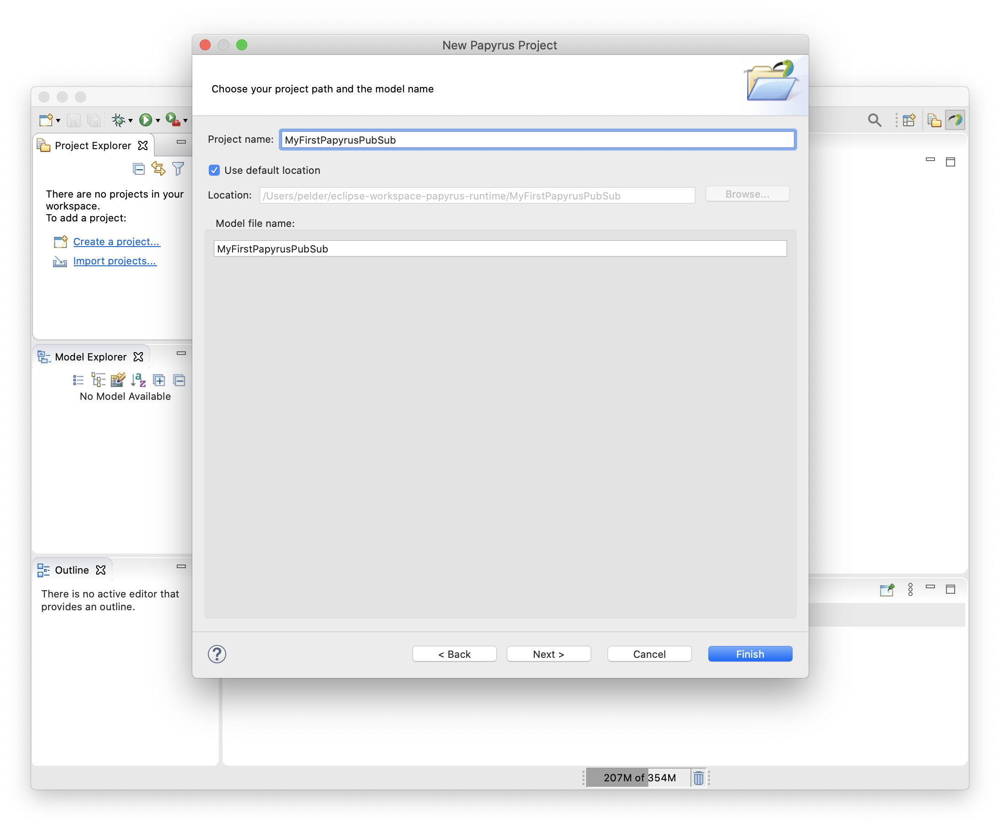

# Create a CX Papyrus Model

Once you have [installed Papyrus and CX](install-papyrus.md),
you can create your first Papyrus model for CX. Follow the following steps.

## 1. Open the Papyrus perspective

From the `Window` menu, choose `Perspective > Open Perspective > Other`,
then in the presented dialog, choose `Papyrus` and click `Open`.

## 2. Create a new Papyrus project

From the `File` menu, `New > Papyrus Project` to open the `New Papyrus Project` wizard.

## 3. Select the CX architecture

In the `New Papyrus Project` wizard, on the `Select Architecture Context` page,
choose one of `ATCD` or `AXCIOMA`, the two available CX architectures.
Click `Next`.

## 4. Enter the CX project name

On the CX project page, enter the name of the project, and optionally,
a model name. Click `Finish` to complete the wizard and create the project.

