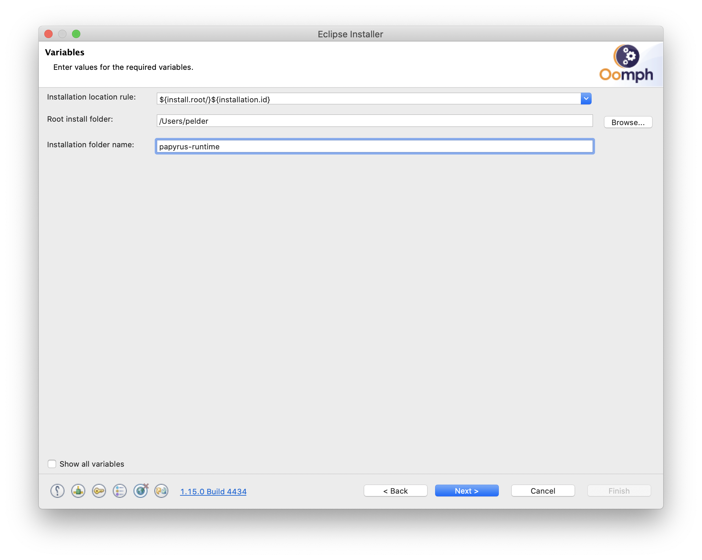

# Introduction

This page gives basic instructions for installing Papyrus.
Papyrus may be installed in any number of ways.
This method is meant to be simple, and to lead to a minimal installation.
Note that CX currently builds against Papyrus 2019-06, but that these instructions reference 2019-12.
If you encounter problems using 2019-12 (or a later release),
please let use know by [raising an issue](https://github.com/ZeligsoftDev/CX4CBDDS/issues).

# Installation Process

## 1. Download the Eclipse Installer.

Visit [https://www.eclipse.org/downloads/](https://www.eclipse.org/downloads/), and click the link to download the Eclipse Installer.

##  2. Start the Eclipse Installer

For Windows users, after the Eclipse Installer executable has finished downloading it
should be available in your download directory.
Start the Eclipse Installer executable.
You may get a security warning to run this file.
If the Eclipse Foundation is the Publisher, you are good to select Run.

For Mac and Linux users, you will still need to unzip the download to create the Installer.
Start the Installer once it is available.

## 3. Change to Advanced Model

Click the _hamburger_ icon (the three stacked lines), and choose `Advanced Mode`.

## 4. Select Eclipse Platform

In the Advanced Mode installer, select `Eclipse Platform`, then click `Next`.

## 5. Enter an Installation Name

In `Projects` page of the wizard, make no selections, and click `Next`.

In the `Variables` wizard page, choose and enter a installation namne, then click `Next`.

## 6. Confirm and Finish the installation

In the `Configuration` page, click `Finish` to start the installation.

## 7. Start Eclipse

Once Eclipse is installed, ensure it is started, then select `Help > Install New Software`
from the menu. The Install wizard will start.

## 8. Choose the Eclipse release update site

From the Install wizard, use the `Work with` drop-down to select the Eclipse
release URL.

## 9. Select Papyrus

Enter the text `papyrus` in the filter box below the `Works with` drop-down, then
click `Papyrus for UML` in the tree list, below.
Click the `Next` button, and continue with the wizard to complete the installation.
When prompted, restart Eclipse.

## 10. Install CX

Once Eclipse has restarted, use the `Help > Install New Software` menu to start
the Install wizard again.

## 11. Select the CX installation ZIP

Use the `Add` button, then use the `Archive` button to browse for the CX installation
ZIP file.

## 12. Select CX CBDDS

From the list of available components, select `CX CBDDS`, then click Next.
Follow the remainder of the Install wizard to complete the installation and
restart Eclipse.

## 13. Next Steps

[Create a Papyrus Model](create-papyrus-model.md)

